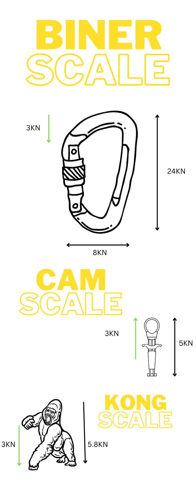

 # The Heavy Send
 ### Thu Oct 20 17:06:26 PDT 2022
 
 On Oct 19, Mechanical Engineering Students were evaluating the forces at play while being lowered after a top-rope climb.

 I volunteered to belay these students in return for data to answer a few questions of my own.

 1. How much Force do i apply on the quick-draw when i fall on lead?
 2. How much Force do i apply on the Top Rope anchor when i take a big whipper?
 3. How is the force distributed between the anchor, rope and the belayer?
 4. How much does it hurt to belay me?

# The experiment
 
 I was belayed by Roan who weighs 234.7 lbs, i weigh about 196 lbs. This is a nice check when climbing as you would always prefer to have a belayer >= 50% of your weight, so that the belayer is able to effectively belay you without being elevated.
 
 We were supervised by Mohammed, who we requested to turn on the sensors for the climb up. I asked Roan to feed me slack all the way to recreate a lead climbing experience.
 
 *Dyno is when the climber makes a dynamic movement that uses momentum to get to the next hold.*
 
 ## First Send
 The First Dyno attempt, i leaped too high, with the hold being too close to my upper torso. This resulted in a blood blister on my left hand to an unexpected fall.

 This generated a spike of 3.1 kN.

 ## Second Send
 The Second Dyno attempt, i climbed a bit higher, and leaped for the top of the climb with no intention to reach it. I free fell for the next few seconds, creating a larger tension on the anchor of 3.27 kN.
 

# The Analysis

 1. Time Series Analysis:
 	As the figure above suggests, there are small oscillatory motions that are unexplained, i would like to see if they are random noise or there is a pattern that needs to be evaluated.

	- General Observations:

	

	As can be seen from the image above, after 32s until 33.4, i ask for Roan for slack, hence most of my weight is on the wall and none is on the rope.

	i leaped for about 10s, which brought the force on the anchor to low 100s.

	after 34.5s, I started free falling for 0.5s this means after Roan caught me the slack extended for about 0.5s, the force rose from 
	
	[105.43810 ->  522.32739 ->1127.98857 ->1205.29755 ]

	the force rises by about 5 times in the first 0.1s and then falls to 2 times to coming to stand still at 3273 N.
	
	this is when the dynamicity of the rope comes into play, so for the next 0.5s the rope absorbs the force.

	After this i get back on the wall, so the forces oscillate around 1000 until i get lowered as i am keeping my weight mostly on the harness, with no hands on the wall.
	
	

	- First Differences:
	The First Differences shows the peak and the dip right after the fall, so as per the data it suggests the displacement was 2075.317 N over half a second.

# Results

## How much force do i apply on the anchor on top rope whip?
I applied about 3273 N, on this specific climb. This was done with slack however it doesn't accurately replicate the lead climb whip as those whips are sometimes done above the anchor leading to bigger fall maximum of twice the distance if you fall while clipping.

This makes me wonder, how much the trad nuts and cams withstand when a climber whips. There is emphasis on placing the gear right as if placed right the force is transferred on the rock if not the piece just pops out.

the infograph above displays visually how much force i exert on the climbing equipment as i whip.
 - Biner Scale: i used a Black Diamond Locking Biner for reference
 - Cam Scale: I used the smallest cam, i could find.
 - Kong Scale: the weakest gorilla punch is 5KN, still enough to smash one's head. 

## How much does it hurt to Belay me?
So i weigh 196 lbs, me standing exerts a force of 871.85 N on the ground ( found thanks to Newtons Second Law).

Roan felt approximately 37N as i climbed, when i whipped he elevated, that's because he weighs 1054.83 Ns and i generated 3273 Ns. As he placed his legs on the wall and braced himself the weight was now transferred on the anchor and the rope mostly.

As i stayed still on the wall after the fall, i was exerting 2080 Ns hence he remained elevated until i lowered enough till about the my forces were equal or less than his, which is until i reached safely on the ground.

# Conclusion
The pain to belay me is very strongly correlated with how ill-fitting your harness is and how light you are compared to me.
Every action has an equal and opposite reaction, so if i whip, you fly. 

